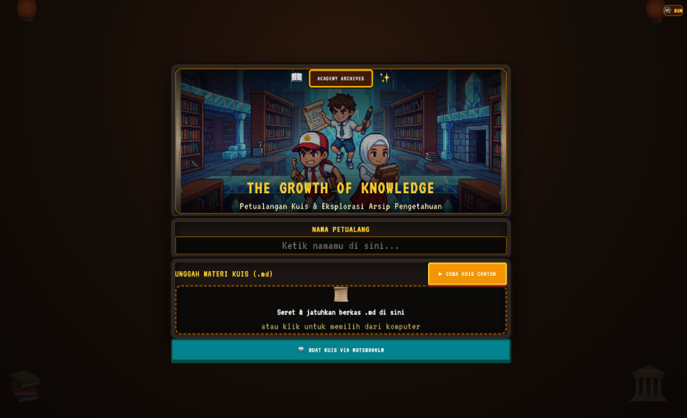
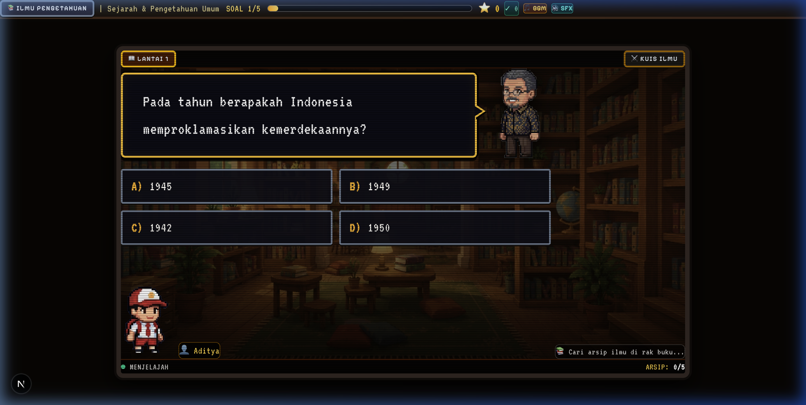
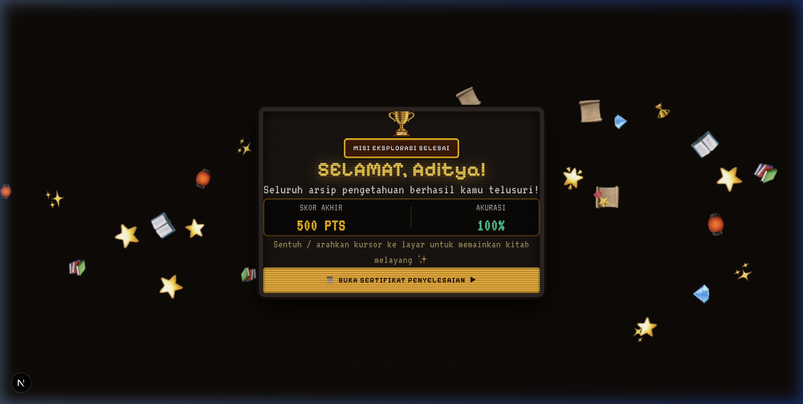

# 🎮 The Growth of Knowledge

> **Petualangan Kuis & Eksplorasi Arsip Pengetahuan** — Sebuah platform gamifikasi kuis berbasis RPG 8-bit retro yang mengubah materi belajar Markdown menjadi pengalaman petualangan interaktif.



---

## ✨ Fitur Utama

| Fitur | Deskripsi |
|---|---|
| 📜 **Upload Materi Markdown** | Unggah file `.md` berisi materi pelajaran — kuis akan dibuat otomatis |
| 🎓 **Karakter Pelajar** | Pilih petualang (Murid Laki-laki / Murid Perempuan) & masukkan nama sebelum memulai |
| 🧑‍🏫 **Dialog & Animasi Pak Guru** | Pertanyaan interaktif typewriting dengan animasi bicara natural & outer cell shading putih |
| ⭐ **Sistem Poin & Bintang** | Jawaban benar memberikan poin; hasil akhir ditampilkan dengan rating bintang |
| 👨‍👩‍👧 **Laporan & Analisis Orang Tua** | Rangkuman evaluasi belajar & analisis kesalahan jawab untuk bimbingan orang tua/guru di rumah |
| 📸 **Capture & Export Ringkasan** | Unduh laporan evaluasi dalam bentuk gambar PNG atau salin format teks rapi ke WhatsApp |
| 🏆 **Sertifikat Digital** | Sertifikat kelulusan bertema *Ancient Academy* berformat PNG & PDF berkualitas tinggi |
| 🎵 **Audio BGM & SFX** | Musik latar 8-bit retro + efek suara typewriting; dapat dimatikan kapan saja |
| 📒 **Integrasi NotebookLM** | Buat soal kuis otomatis dari materi melalui Google NotebookLM |

---

## 🖼️ Tampilan & Alur Aplikasi

### 1. Halaman Utama — Masukkan Nama & Unggah Materi

Saat pertama membuka aplikasi, pelajar akan:
1. Memasukkan **nama / nama petualang** di kolom yang tersedia
2. **Mengunggah file Markdown** (`.md`) berisi materi pelajaran dengan cara **seret & jatuhkan** atau klik area unggah
3. Menekan **"Coba Kuis Contoh"** untuk langsung mencoba tanpa file — atau klik **"Buat Kuis via NotebookLM"** untuk generate soal otomatis


---

### 2. Sesi Kuis — Dialog Pak Guru & Pilihan Jawaban

Saat kuis berlangsung:
- Pertanyaan muncul dengan animasi **typewriting** dalam **balon komik 2 baris yang stabil** dari Pak Guru
- Karakter Pak Guru memiliki animasi **gerakan mulut natural (*talking cadence*)** saat teks berjalan dan diam saat jeda/selesai
- Outline karakter dilapisi **white cell shading** tipis untuk kontras visual optimal
- Sprite **karakter pelajar** berjalan di bawah panggung perpustakaan ajaib
- **Progress bar** di atas menampilkan lantai soal dan poin terkumpul
- Pilih jawaban A / B / C / D, lalu lanjut ke soal berikutnya
- **BGM** dan **SFX** dapat dimatikan/dihidupkan sewaktu-waktu dari pojok kanan atas



---

### 3. Layar Hasil & Sertifikat Kelulusan

Setelah semua soal terjawab:
- Layar menampilkan **Skor Akhir** (dalam poin) dan **Akurasi** (persentase jawaban benar)
- Animasi perayaan menyelesaikan misi eksplorasi ilmu
- Tekan **"Buka Sertifikat Penyelesaian"** untuk melihat diploma kelulusan bergaya gulungan kuno (dapat diunduh sebagai PNG atau PDF)
- Tekan tombol **"Laporan Orang Tua 📋"** untuk membuka evaluasi belajar mendalam



---

### 4. 👨‍👩‍👧 Laporan & Analisis Evaluasi Belajar (Fitur Orang Tua & Guru)

Fitur khusus yang dirancang untuk membantu orang tua dan guru memahami performa belajar anak secara menyeluruh setelah kuis selesai:

#### 📊 Poin-poin yang Disajikan:
1. **Rangkuman Capaian**: Skor total, persentase akurasi, rasio jawaban benar/salah, serta status level pemahaman (*Sangat Menguasai*, *Perlu Latihan*, atau *Perlu Bimbingan Khusus*).
2. **Analisis Kesalahan Jawab (Poin yang Masih Kurang)**:
   - Filter khusus untuk melihat hanya soal-soal yang salah dijawab oleh anak.
   - Perbandingan jelas antara **❌ Jawaban Siswa (Keliru)** dan **✅ Kunci Jawaban Benar**.
   - **💡 Konsep Kunci / Petunjuk Materi**: Penjelasan ringkas mengenai konsep yang perlu diulang bersama orang tua di rumah.
3. **Rekomendasi Bimbingan**: Panduan praktis bagi orang tua mengenai topik spesifik yang perlu diperkuat.

#### 📸 Fitur Ekspor & Berbagi Laporan:
- **📸 Unduh Gambar (PNG)**: Meng-capture seluruh kartu laporan evaluasi menjadi gambar beresolusi tinggi dengan 1 klik.
- **📋 Salin Ringkasan (WhatsApp Ready)**: Menyalin seluruh laporan performa dan rincian kesalahan jawab ke clipboard dalam format teks rapi, siap dikirimkan ke grup chat keluarga atau wali kelas.

---

## 🚀 Cara Menjalankan

### Prasyarat

- [Node.js](https://nodejs.org/) v18 atau lebih baru
- npm / yarn / pnpm

### Instalasi & Jalankan

```bash
# Clone repositori
git clone https://github.com/SMJ-205/school-quiz-gamification.git
cd school-quiz-gamification

# Install dependensi
npm install

# Jalankan dev server
npm run dev
```

Buka [http://localhost:3000](http://localhost:3000) di browser.

### Build Produksi

```bash
npm run build
npm start
```

---

## 📁 Struktur Proyek

```
school-quiz-gamification/
├── app/
│   ├── page.tsx                 # Routing & screen switcher
│   ├── layout.tsx               # Root layout & font
│   └── globals.css              # Global styles, animasi komik & CRT
├── components/
│   ├── IngestionScreen.tsx      # Upload Markdown & input nama siswa
│   ├── CharacterCustomizer.tsx  # Pemilihan avatar (Murid Laki-laki/Perempuan)
│   ├── ParentReportModal.tsx    # Modal analisis kesalahan jawab & laporan orang tua
│   ├── CertificateCanvas.tsx    # Render & ekspor sertifikat digital (PNG/PDF)
│   ├── AntigravityCanvas.tsx    # Layar hasil perayaan kuis
│   ├── PixelProgressBar.tsx     # Progress bar + tombol audio BGM/SFX
│   └── quiz/
│       ├── QuestionPanel.tsx    # Dialog komik 2 baris + animasi Pak Guru
│       └── EnchantedLibrary.tsx # Arena kuis panggung perpustakaan
├── lib/
│   ├── audioEngine.ts           # Singleton engine audio BGM & SFX
│   ├── markdownParser.ts        # Parser materi Markdown → struktur soal kuis
│   └── constants.ts             # Opsi karakter, rating bintang, prompt NotebookLM
├── public/
│   ├── audio/                   # File musik latar (.mp3)
│   ├── sprites/                 # Sprite karakter (teacher_talking.png, teacher_idle.png)
│   ├── backgrounds/             # Background perpustakaan retro
│   └── screenshots/             # Dokumentasi screenshot
└── store/
    └── useGameStore.ts          # Zustand store: tracking jawaban & state kuis
```

---

## 📝 Format File Markdown

File Markdown yang diunggah akan diparse secara otomatis. Gunakan format berikut:

```markdown
---
title: Sejarah & Pengetahuan Umum
subject: IPS
grade: 5
author: The Growth of Knowledge
---

### Q1
Siapakah tokoh yang membacakan naskah Proklamasi Kemerdekaan Indonesia?
- [ ] Mohammad Hatta
- [x] Ir. Soekarno
- [ ] Sutan Sjahrir
- [ ] Achmad Soebardjo
*Hint: Beliau adalah Presiden pertama Republik Indonesia.*

### Q2
...
```

---

## 🔊 Pengaturan Audio

| Kontrol | Lokasi | Keterangan |
|---|---|---|
| **BGM** | Pojok kanan atas | Musik latar 8-bit retro |
| **SFX** | Pojok kanan atas / Otomatis | Efek suara klik, blip bicara, benar/salah |

---

## 🛠️ Tech Stack

- **Framework**: [Next.js 16](https://nextjs.org/) (App Router)
- **Bahasa**: TypeScript
- **State Management**: [Zustand](https://zustand-demo.pmnd.rs/)
- **Styling**: Vanilla CSS + Tailwind CSS + Google Fonts (Press Start 2P, Outfit, Cinzel, Silkscreen)
- **Image/PDF Generation**: `html-to-image`, `jspdf`
- **Audio**: Web Audio API + HTML5 Audio (singleton engine)
- **Deployment**: [Vercel](https://vercel.com)

---

## 📄 Lisensi

MIT License — Bebas digunakan untuk keperluan pendidikan dan penelitian.

